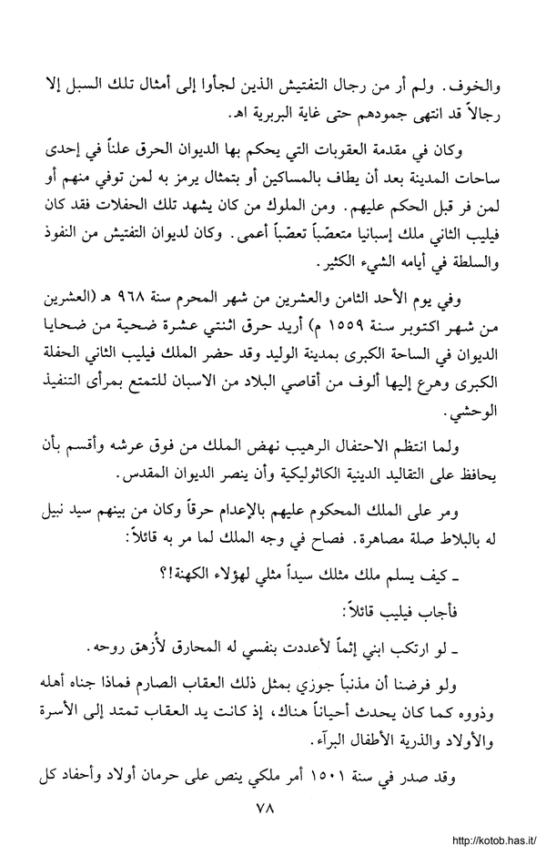
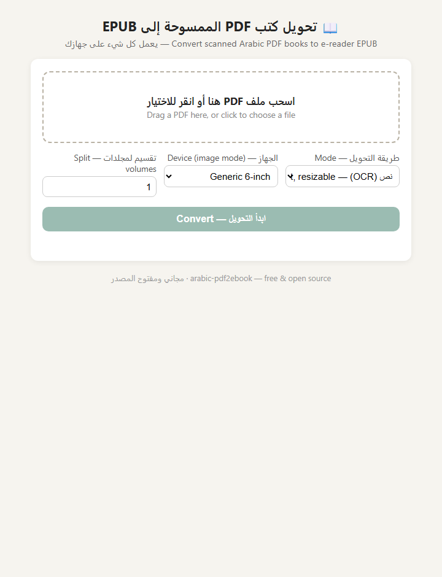

# arabic-pdf2ebook 📖

**Convert scanned Arabic PDF books into EPUBs you can actually read on any e-reader.**

<div dir="rtl">

**🇸🇦 اقرأ الدليل الكامل بالعربية: [README.ar.md](README.ar.md)**

</div>

| Before: scanned PDF page | After: real resizable text | The local web page |
|---|---|---|
|  |  |  |

Old scanned Arabic books (from Noor-Book, kotob.has.it, archive.org…) are image-only PDFs:
on a small e-reader the text is tiny, blurry, and can't be resized. This tool fixes that — locally,
for free, with no cloud upload.

## ✨ Features

- **Text mode (OCR)** — recognizes the Arabic text and builds a *reflowable* right-to-left EPUB:
  resizable text, embedded Amiri font, correct RTL page turning, table of contents,
  automatic removal of watermarks (`http://kotob.has.it/` …) and page numbers.
- **Neat structure** — every page (OCR *or* the PDF's own text layer) is reconstructed into clean
  Markdown internally — headings detected by font size, paragraphs rejoined, bullet/numbered lists
  preserved — and then turned into the EPUB. Books with a real text layer come out especially tidy.
- **Classical poetry & Quranic quotes** — rhymed verse blocks (قصائد) are detected and kept
  one بيت per centered line instead of being flattened into prose; Quranic quotes get their
  ornate brackets ﴿…﴾ restored and distinct styling when the book marks them (قرآن كريم, سورة…).
- **Image mode** — no OCR: cleans each page (deskew, denoise, contrast, margin crop),
  resizes it for your reader's screen, and packs the pages into an EPUB (and optionally CBZ).
  100 % faithful to the original print.
- **Auto mode (default)** — uses the PDF's own text layer when it exists *and is healthy*
  (many books embed a broken one — we detect that), OCRs the rest, and keeps
  photos/maps/failed pages as cleaned images so you never get garbage text.
- **Huge books welcome** — pages stream one at a time (a 2,400-page book converts in
  constant memory), every stage is cached and resumable, and output can be split into volumes.
- **Local web page** — `pdf2ebook ui` opens a friendly bilingual drag-and-drop page in your
  browser. Everything still runs on your own computer.
- **Wi-Fi send** — `pdf2ebook send book.epub` uploads straight to a
  [CrossPoint](https://github.com/crosspoint-reader/crosspoint-reader) e-reader (Xteink X3/X4).
- **Arabic font included, everywhere** — every EPUB embeds the Amiri font (phones, Apple
  Books, Kobo render Arabic with zero setup). For readers with no Arabic support at all,
  the font ships ready-to-install: `pdf2ebook fonts install --host <reader-ip>` puts it on a
  CrossPoint reader over Wi-Fi (pair with `--preshape`), and `pdf2ebook fonts export` writes
  a folder with the TTF + instructions for Kobo and others. Full per-device guide:
  [docs/devices.md](docs/devices.md).

## 🚀 Quick start

```bash
# 1. install the tool (Python 3.10+)
pip install arabic-pdf2ebook

# 2. install Tesseract OCR (needed for text mode only)
#    Windows:
winget install UB-Mannheim.TesseractOCR
#    Linux: sudo apt install tesseract-ocr    macOS: brew install tesseract

# 3. convert!
pdf2ebook convert "my-scanned-book.pdf"            # auto mode → book.epub
pdf2ebook convert "my-scanned-book.pdf" --mode image   # image mode (no OCR needed)

# or use the friendly web page:
pdf2ebook ui
```

The Arabic OCR model (`ara.traineddata`, best quality) is downloaded automatically on first use —
no manual setup.

## 🖥️ The web page

`pdf2ebook ui` (or just double-clicking `pdf2ebook.exe` from the
[Releases](../../releases) page) opens `http://127.0.0.1:8765`:

drag your PDF → pick **Text** or **Images** → Convert → Download / **Send over Wi-Fi**.

## 📚 Common recipes

```bash
pdf2ebook inspect book.pdf                  # pages? text layer? what mode to use?
pdf2ebook convert book.pdf --pages 5-20     # test settings on a few pages first
pdf2ebook preview book.pdf --mode ocr       # eyeball the cleaned page images
pdf2ebook convert book.pdf --mode image --device xteink-x4 --cbz
pdf2ebook convert big-book.pdf --split-volumes 4
pdf2ebook send book.epub --host 192.168.1.50
pdf2ebook devices                           # list device profiles
```

## 🎯 OCR accuracy on old prints

Old Arabic prints are hard for every OCR engine. This tool stacks the known accuracy levers:

1. `tessdata_best` Arabic model + LSTM engine
2. preprocessing tuned for old paper: Sauvola adaptive binarization, CLAHE contrast,
   denoising, deskew, margin removal, upscaling of small print
3. a rescue pass that re-OCRs low-confidence pages with an alternate binarization
4. a confidence gate: pages that still fail are embedded as **cleaned images** instead of
   garbage text (the conversion summary tells you how many)

When Tesseract isn't good enough, install the optional neural engine and use `--engine surya`:

```bash
pip install "arabic-pdf2ebook[surya]"
```

Expectation setting: OCR output is meant for comfortable *reading*, not scholarly fidelity.
For a 100 % faithful copy, use `--mode image`.

---

## بالعربية

### ما هذه الأداة؟

كثير من الكتب العربية القديمة متاحة فقط كملفات PDF ممسوحة ضوئيًا، فلا يمكن تكبير
النص أو إعادة تدفّقه على القارئ الإلكتروني. هذه الأداة المجانية مفتوحة المصدر تحوّل تلك
الكتب إلى EPUB — على جهازك مباشرة دون رفع الملفات إلى الإنترنت.

### طريقتا التحويل

- **وضع النص**: تتعرف الأداة على النص العربي (OCR) وتبني كتاب EPUB حقيقيًا — نص قابل
  للتكبير، خط أميري مدمج، اتجاه من اليمين لليسار، فهرس، وحذف تلقائي للعلامات المائية
  وأرقام الصفحات.
- **وضع الصور**: بدون تعرف على النص — تنظيف كل صفحة (تسوية الميل، إزالة الضوضاء،
  تحسين التباين، قص الهوامش) وتحجيمها لشاشة قارئك. مطابق تمامًا للأصل.

### البدء السريع

```bash
pip install arabic-pdf2ebook
winget install UB-Mannheim.TesseractOCR
pdf2ebook ui
```

ثم اسحب ملف PDF إلى الصفحة التي تُفتح في المتصفح، واختر طريقة التحويل، وحمّل ملف
EPUB الناتج — أو أرسله مباشرة إلى قارئ CrossPoint عبر Wi-Fi.

لمن لا يريد تثبيت بايثون: حمّل `pdf2ebook.exe` من صفحة
[الإصدارات](../../releases) وانقر عليه نقرًا مزدوجًا.

---

## License

Apache-2.0 — see [LICENSE](LICENSE). Bundled Amiri font is under the SIL OFL 1.1;
see [THIRD_PARTY_NOTICES.md](THIRD_PARTY_NOTICES.md).
